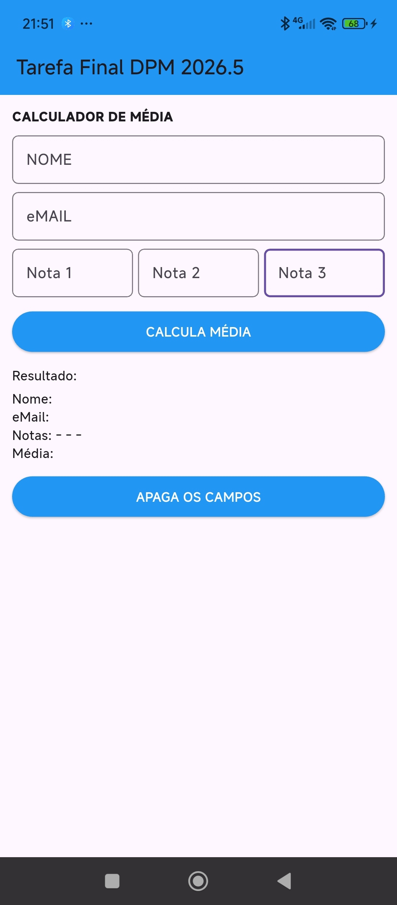
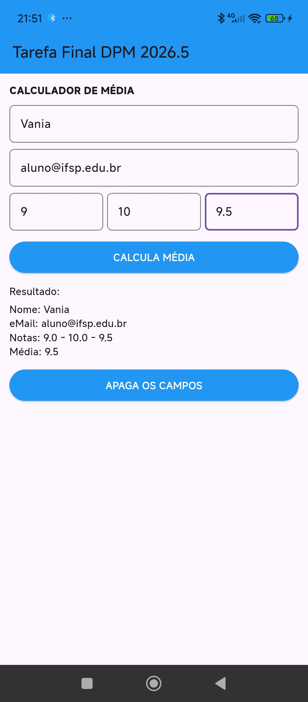

# Exercício - Tarefa Final DPM 2026.5 - Stateful Widget

Calculador de Média

## Descrição

Este projeto foi desenvolvido com o objetivo de praticar o uso de **StatefulWidget** no Flutter, permitindo a interação do usuário com a interface.

A aplicação consiste em uma calculadora de média, onde o usuário informa seus dados e notas, e o sistema calcula e exibe o resultado na tela.

---

## Objetivo

- Utilizar StatefulWidget
- Trabalhar com entrada de dados (TextField)
- Realizar cálculos em Dart
- Atualizar a interface com setState()
- Limpar dados da tela

---

## Funcionalidades

- Inserir:
  - Nome
  - Email
  - Nota 1
  - Nota 2
  - Nota 3
- Calcular média
- Exibir:
  - Nome
  - Email
  - Notas
  - Média
- Botão para limpar todos os campos

---

## Widgets Utilizados

- Scaffold
- AppBar
- Column
- Row
- Text
- TextField
- ElevatedButton
- SizedBox

---

## Tecnologias

- Flutter
- Dart
- Android Studio

---

## Funcionamento

1. O usuário preenche os campos
2. Clica em **CALCULA MÉDIA**
3. O sistema calcula a média das notas
4. Os dados são exibidos na tela
5. O botão **APAGA OS CAMPOS** limpa todas as informações

---

## Como executar

abra este link em seu navegador, copie o codigo que esta neste repositorio "calculadordemedia" e click em RUN.

https://dartpad.dev/
